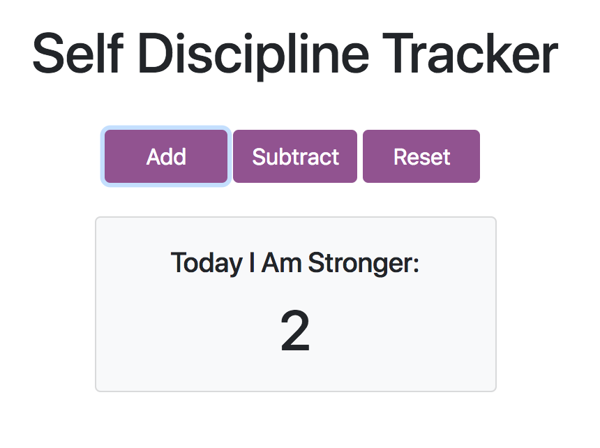

# Self Discipline Tracker

## Objective
Build a Node.js manual counter app and host it in firebase using cloud functions and a realtime database.

## Steps Taken
I started by using the firebase documentation to set up a basic project and also create my realtime database. I was able to host the Node.js and Express application using cloud functions while storing my css and script file on firebase hosting. The trickiest part of building this app was getting my mind around the realtime database data structure, and writing the scripting to pull and update data from a document. I first split this functionality between the server-side code and the script code but found I needed to manipulate the dom frequently during use, so I moved most of the functionality over to the script file for the final app.

## Outcome
The live app is deployed [here](https://self-discipline-tracker.firebaseapp.com/). I was able to achieve all the MVP requirements using firebase and the real time database is very responsive. I look forward to using this platform for more projects in the future!

